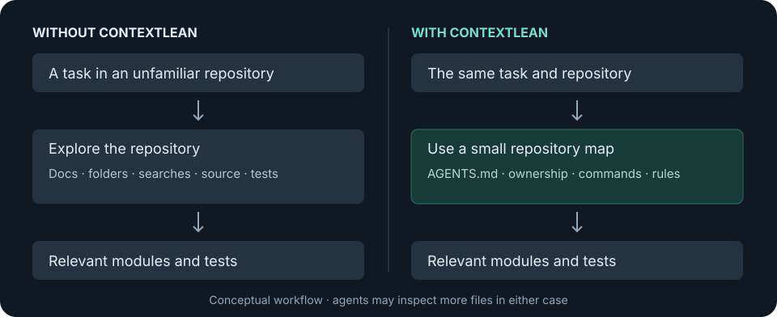

# ContextLean

Help coding agents find the right code with a small, maintained repository map.

ContextLean gives Codex and Claude Code a small map of your repository so they can
find the right code with less repeated exploration. It creates and checks guidance
about the project, important code, useful commands, and rules that changes must preserve.



*An intended navigation pattern, not a trace of every agent run or a measured saving.*

## The problem

A coding agent entering an unfamiliar project may read documentation, list folders,
search source files, and inspect tests before it finds the code that matters.
That exploration is useful, but repeating it can consume time and attention.
ContextLean records the stable directions once and helps you keep them accurate.

- **Context window:** the information an agent can work with at one time. Unrelated
  material takes room that could hold the task and relevant code.
- **Tokens:** the units a model reads and writes. Prompts, code and tool results all
  contribute to usage; fewer files do not automatically mean fewer tokens.
- **Repository exploration:** reading and searching to learn where things live.
- **Tool calls:** actions such as searching files or running tests. Necessary checks
  still matter even when they increase usage.

The intended result is less unnecessary exploration while preserving correct work.
ContextLean does not guarantee savings or make a model inherently smarter.

## What ContextLean does

- **Bootstrap Repository** inspects your project once and writes lean repository
  instructions: a small project map, verified commands and important rules.
- **Audit Context Locality** checks whether those directions still match the code.
- **Lean Change Review** checks changes for unnecessary complexity and scattered ownership.
- **Benchmark Context Usage** measures structure offline or, when explicitly requested,
  compares real model runs and their outcomes.

## Before vs After

**Preliminary validation batch — 1 run per condition per task.**

Five tasks in a small Python expense-report project, using `gpt-5.6-terra` with low
reasoning on 2026-09-30. Vanilla had no repository instructions; ContextLean had the
same starting code plus a frozen repository map. Both runs in every pair passed the
acceptance checks and original regression tests.

| Task | Vanilla tokens | ContextLean tokens | Difference | Success |
|---|---:|---:|---:|---|
| Navigation | 48,156 | 26,441 | −45.1% | Both pass |
| Bug fix | 88,404 | 59,206 | −33.0% | Both pass |
| Feature | 109,417 | 97,114 | −11.2% | Both pass |
| Refactor | 72,376 | 84,130 | **+16.2% more** | Both pass |
| Documentation/config | 85,019 | 88,416 | **+4.0% more** | Both pass |

Across these five single-run task pairs:

| Aggregate metric | Vanilla | ContextLean | Difference |
|---|---:|---:|---:|
| Total tokens | 403,372 | 355,307 | −11.9% |
| Input tokens | 396,727 | 350,329 | −11.7% |
| Output tokens | 6,645 | 4,978 | −25.1% |
| Wall time | 188.28 s | 149.85 s | −20.4% |
| Command calls | 15 | 13 | −13.3% |
| Task success | 5/5 | 5/5 | Same |

In this 10-run batch, total tokens were 11.9% lower in aggregate, but **two tasks
used more tokens**. Refactor also took longer; documentation/config used one extra
command call. This is preliminary evidence, with no variance estimate or statistical
confidence. Additional repeated trials are needed for stronger conclusions.

CLI cache warnings, recovered patch errors and failed Git checks in the non-Git
sample copies could affect the comparison. File-read counts and total tool-call counts
were unavailable. An incorrect solution is not a win, even if it uses fewer tokens.
[Exact methodology, all ten raw runs and limitations](benchmarks/results/2026-09-30-validation/README.md).

## Quick start

You need an installed, working Codex or Claude Code, and Python 3.11+ for the local
report helper. Use a local checkout of this repository; ContextLean is not in a
public marketplace yet.

1. **Install / load ContextLean.** For Codex, run these from the ContextLean checkout:

   ```sh
   codex plugin marketplace add .
   codex plugin add contextlean@contextlean-local
   ```

   Claude Code can load the checkout for one session using `--plugin-dir` in step 2.
   No separate plugin-authoring tool is needed.

2. **Open your project.** Start a fresh agent session in the repository you want to configure:

   ```sh
   cd /path/to/my-project
   codex
   ```

   Or, for Claude Code:

   ```sh
   cd /path/to/my-project
   claude --plugin-dir /path/to/contextlean
   ```

3. **Invoke Bootstrap Repository.** In Codex CLI, open `/skills` or type `$`,
   then select **Bootstrap Repository** from ContextLean (installed name
   `contextlean:bootstrap`). Add “Bootstrap this repository.” In Claude Code, enter
   `/contextlean:bootstrap` followed by the same request. `$bootstrap` alone is
   not the installed plugin's full name.

4. **Inspect the generated guidance.** Review the changes to `AGENTS.md`, any
   `CLAUDE.md` imports, and related configuration. Select **Audit Context Locality**
   in Codex, or enter `/contextlean:audit` in Claude Code, for an evidence-based check.
   Commit useful guidance with your project.

5. **Use the agent normally.** Start a new session so it loads the new guidance.
   Ask for your usual coding tasks. Audit again when structure or commands change.

If the four skills are missing, confirm the plugin is enabled and start a new session.
Codex installs a cached copy: after editing the plugin, reinstall it and restart.
See [installation details and verification status](docs/verification.md).

## What gets created?

Bootstrap writes repository guidance; it does not change your application's behavior.
A small project might change like this:

```text
Before                         After
my-project/                    my-project/
├── app/                       ├── AGENTS.md
├── tests/                     ├── CLAUDE.md
└── README.md                  ├── .contextlean/
                               │   └── bootstrap-report.json
                               ├── app/
                               ├── tests/
                               └── README.md
```

- `AGENTS.md`: a concise project map, ownership boundaries, verified commands and rules.
  Existing guidance is preserved and improved. Nested maps are added only when needed.
- `CLAUDE.md`: normally `@AGENTS.md`, so Claude reads the same guidance. Substantial
  existing Claude notes can move to an optional reference without losing knowledge.
- `.contextlean/bootstrap-report.json`: local instruction counts and explicitly labelled
  estimates. During bootstrap, `.bootstrap-baseline.json` temporarily holds the before state.
  Reports are not agent instructions and are not automatically loaded.
- Only when justified: safe generated-file exclusions, optional references and reusable
  project skills. There is no fixed bundle of extra files for every project.

Keep `.contextlean/` out of Git. This checkout ignores it; check your project's ignore
rules too. Live benchmark reports default there, unless you choose another output directory.

## What is AGENTS.md?

`AGENTS.md` is repository guidance that compatible coding agents can read when they
start work. It gives directions without replacing the code or tests. For example:

```md
# Project map
- API routes: app/api.py
- Business logic: app/services.py
- Security checks: app/security.py
- Tests: tests/

# Important rules
- Run pytest before finishing.
- Do not bypass server-side request validation.
```

This is an example, not files or commands generated for every repository. ContextLean
tries to keep guidance small instead of copying the README or cataloguing every file.
See the [real sample project map](benchmarks/fixtures/expense-report/AGENTS.md).

## Skills

| Workflow | Codex selector / installed name | Claude Code | What it does |
|---|---|---|---|
| Bootstrap Repository | `contextlean:bootstrap` | `/contextlean:bootstrap` | Creates or improves small repository instructions once. Explicit invocation required. |
| Lean Change Review | `contextlean:lean-review` | `/contextlean:lean-review` | Checks a change for duplicate behavior, unnecessary complexity and scattered ownership. Read-only. |
| Audit Context Locality | `contextlean:audit` | `/contextlean:audit` | Checks whether guidance matches the repository and whether responsibilities remain local. Read-only. |
| Benchmark Context Usage | `contextlean:benchmark` | `/contextlean:benchmark` | Offers an offline structural estimate or opt-in live Codex measurement. |

In Codex, use `/skills` or the `$` selector to choose the installed name above.
[Official skill selection guidance](https://learn.chatgpt.com/docs/build-skills).

For audit, **PASS** means verified with no action needed; **WARNING** means a concern
needs judgment; **ACTION NEEDED** means a concrete mismatch or broken configuration.
An illustrative report might read:

```text
PASS — CLAUDE.md imports the existing AGENTS.md.
WARNING — a startup instruction appears to require a large architecture document.
ACTION NEEDED — AGENTS.md points to a test command that no longer exists.
```

Request `audit fix` explicitly to allow narrow, safe guidance/configuration repairs.
A lean review edits code only when you separately request a fix.

## How it works

The plugin packages four instruction-based workflows, shared by both agents.
Bootstrap inspects the project, preserves useful knowledge, verifies directions and
captures a local static before/after report. Later sessions use the maps; audits
check for drift, and reviews check changes for unnecessary complexity.

Version 0.2.0 has no MCP server, hooks, background process, runtime package or telemetry.
Skill discovery can add skill descriptions to agent context; the workflows themselves
run when invoked. Large optional references stay behind targeted links.

## Benchmark methodology

There are two kinds of evidence:

- **Static estimate:** exact instruction-file counts plus a labelled byte-to-token
  approximation. It does not measure model usage, speed or task quality.
- **Live measurement:** isolated Codex runs with the same task, model, reasoning,
  starting code and evaluator. The graded sample suite covers five task categories.
  The older read-only `benchmark ab` mode measures navigation but leaves answer
  correctness unverified; it cannot support a gain claim.

Live runs consume provider usage and are never part of CI.
The [public validation record](benchmarks/results/2026-09-30-validation/README.md)
records the identical prompts, source snapshot, evaluator, ordering and raw outcomes.
Provider caching and service load were uncontrolled; the plugin itself was excluded
from both conditions to isolate the generated guidance. For reproduction and grading,
use the [benchmark guide](benchmarks/README.md).

## Supported agents

| Agent | Integration | Verified scope |
|---|---|---|
| Codex CLI | Plugin + shared skills; project `AGENTS.md` | Fresh local installation and four packaged skills. Live guidance-consumption status is recorded separately. |
| Claude Code | Same skills; project `CLAUDE.md` imports `AGENTS.md` | Manifest validation and session plugin discovery. Full live workflow is unverified. |

The Codex desktop Plugins Directory is an alternative installation surface described
in the [official packaging guide](https://developers.openai.com/plugins/build/plugins).
This change tests the CLI route. Claude session loading follows the
[official plugin guide](https://code.claude.com/docs/en/plugins).
No other agent integration is claimed. [Detailed verification](docs/verification.md)
separates packaging checks from actual model execution.

## Limitations

Route to code instead of duplicating it. Keep stable information. Avoid documenting
facts that are cheap to rediscover. Preserve correctness and security. Prefer one
clear owner and existing tooling over speculative abstractions.

Guidance can become stale and agents can ignore it. A small map may increase tokens
on easy tasks. Results depend on the model, task, caching and environment. The sample
suite is a small synthetic Python project, not evidence for every real repository.
ContextLean runs locally without telemetry; live runs use your configured model provider.
Raw logs from arbitrary projects need review before sharing.

## Development / contributing

Python 3.11+; the product and test suite use only the standard library.

```sh
python3 -m unittest discover -s tests -v
python3 -m pip install ruff==0.15.7  # development checker only
ruff check .
ruff format --check .
```

[Quality CI](.github/workflows/quality.yml) runs offline tests and checks on Python
3.11 and 3.14. [Contributor guidance](AGENTS.md) maps the package, skills and benchmark
owners. The [verification record](docs/verification.md) lists optional agent validators
and verification limits. Do not add runtime dependencies, hooks or automatic live runs.

## License

[MIT](LICENSE)
